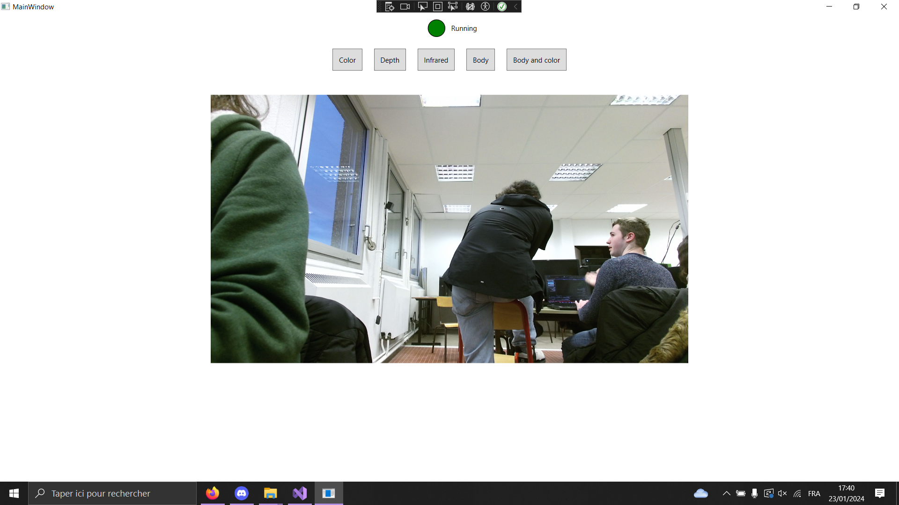
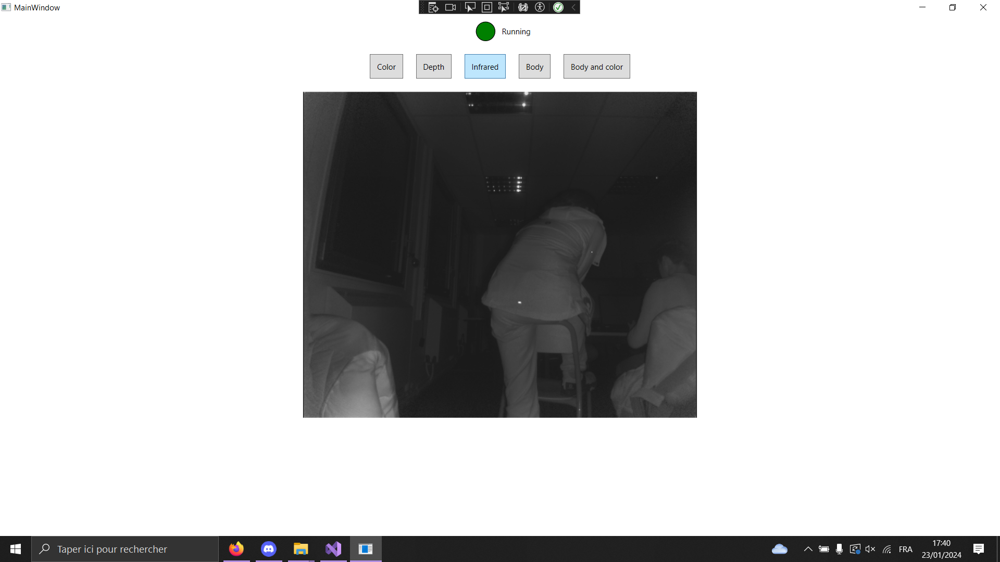
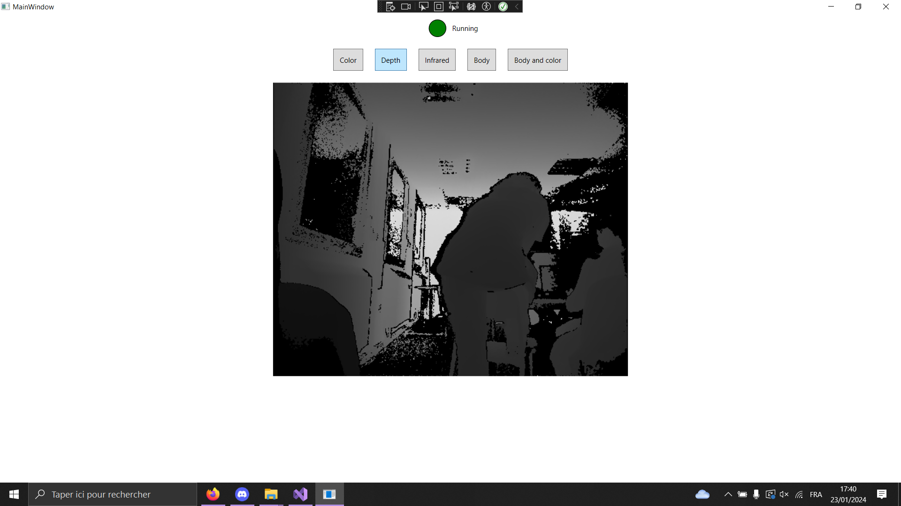
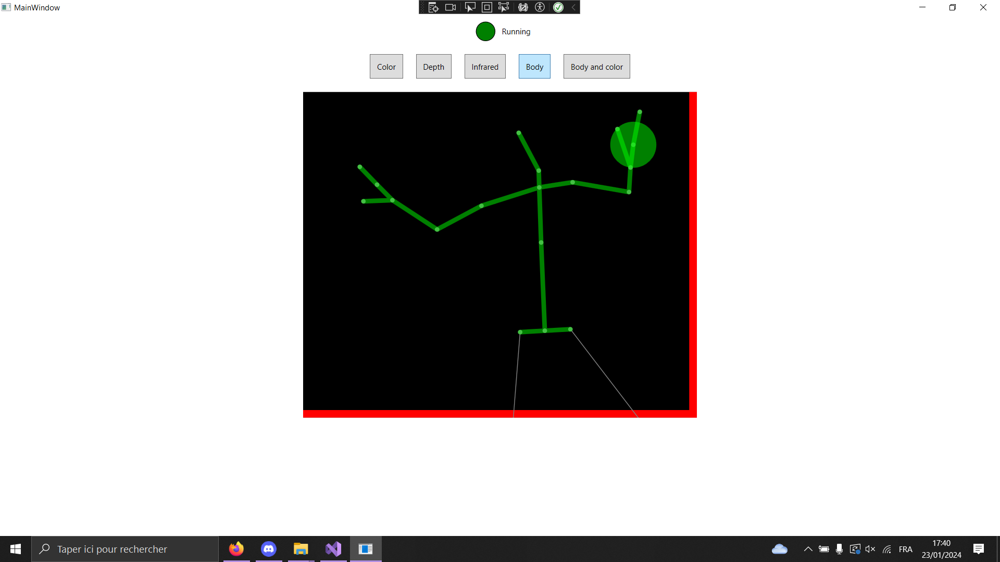
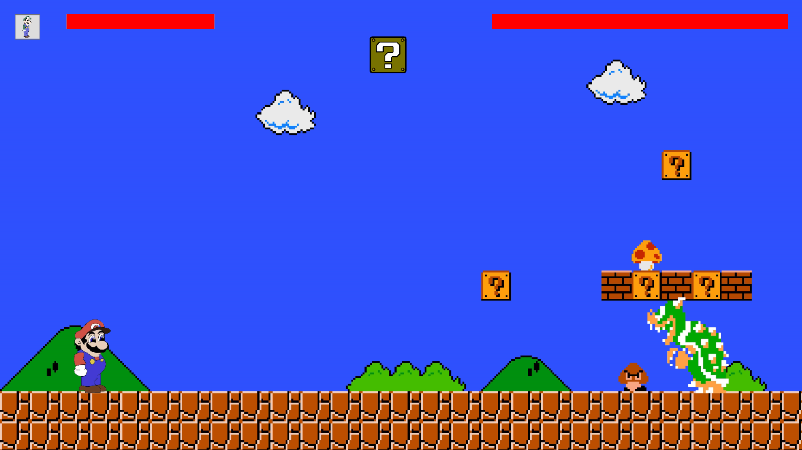

<div align = center>

# Kinect

---

&nbsp; 
&nbsp; 

---

Ce depôt à pour but de regrouper tout les TP de Réalité Virtuel réalisé durant la 3ème année de BUT.

# Répartition du dépôt

[**Sources**](src) : **Code de l'application**

[**Solution de l'application**](src/KinectExercices/KinectExercices.sln) : **Solution de l'application**


### Branches

[**Master**](https://codefirst.iut.uca.fr/git/emre.kartal/Kinect) : Contient l'ensemble des TP.

[**Exercice 1**](https://codefirst.iut.uca.fr/git/emre.kartal/Kinect/src/branch/Ex01) : Exercice 1, lien vers la [consigne !](https://codefirst.iut.uca.fr/git/mchSamples_VR-AR-MR/mchkinectsamples/src/branch/master/exo1_subject.md)


# Récupérer le Projet

Pour récupérer le projet, utilisez la commande suivante dans votre terminal :

```bash
git clone https://codefirst.iut.uca.fr/git/emre.kartal/Kinect.git
```
Ensuite, accédez à la branche souhaitée avec la commande :

```bash
git checkout X
```

Remplacez "X" par le nom de la branche que vous souhaitez utiliser.

Via Visual Studio vous pourrez compiler et lancer le projet, n'oubliez pas de bien brancher votre kinect 😄.

# Visuel du projet
Le projet contient deux solutions.

## KinectExercices - Contenant le TP 1 et 2.
Sur la vue principale, vous pourrez voir, en cliquant sur les boutons, plusieurs types de visuel à partir de la Kinect :

### Color :



### Depth :



### Infrared :



### Body :



## MarioProject - Contenant notre projet pour le TP3.



Le but du jeu est de vaincre le Bowser adverse en tirant des boules de feux, tout en esquivant ses projectiles.

### Contrôles : 
Sauter : Lever un bras en l'air (n'importe lequel)
Droite : Tendre un bras à Droite
Gauche : Tendre un bras à gauche
Boule de feu : Hadouken !

# Technicien 

La composition pour le projet se voit réaliser par deux élèves de l'IUT d'Aubière:

<br>
<u>Emre KARTAL</u> : emre.kartal@etu.uca.fr
<br>
<u>Arthur VALIN</u> : arthur.valin@etu.uca.fr

<br>
<br>

<div align="center">
<a href = "https://codefirst.iut.uca.fr/git/emre.kartal">

</a>
<a href = "https://codefirst.iut.uca.fr/git/arthur.valin">

</a>
</div>

© PM1

</div>

<div align = right>
<a rel="license" href="http://creativecommons.org/licenses/by-nc-nd/4.0/"></a>
<right>
